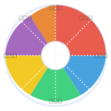

# 企業色相環（Corporate Color Health）

<div align="center">
  
  <p>企業を多次元で理解するための新しい視覚化ツール</p>
</div>

## 📊 プロジェクト概要

「企業色相環」は、企業の複雑な特性を直感的に理解するための新しい視覚化アプローチを提供する静的ウェブサイトです。従来の単一軸（良い・悪い）や財務指標に偏った企業評価を超え、企業の多面的な特性を「カラー分けされた進捗バー」として、健全経営度を「白黒グラデーション」として表現します。

個人投資家、特に初心者から中級者の方々が、数値だけでは見えない企業の特性を把握できるように設計されています。

### 🔍 [デモサイトはこちら](https://ts-ksato.github.io/ColorHealth/)


## ✨ 主な特徴

- **カラー分け進捗バー**: 6つの次元（変革性、安定性、社会性、自律性、伝統性、国際性）をカラフルな進捗バーで視覚化
- **健全度評価**: 企業の健全経営度を白（健全）〜黒（不健全）のグラデーションで表現
- **時系列表示**: 四半期ごとの変化を追跡可能
- **透明性重視**: すべての計算方法と情報源を明記
- **モバイル対応**: スマートフォンでも快適に利用可能

## 🎨 企業特性の6つの次元

| 色相 | 次元 | 内容 |
|------|------|------|
| 🔴 赤 | **変革性** | 革新への投資、チャレンジ精神、変化への適応力 |
| 🔵 青 | **安定性** | 財務健全性、持続可能な経営、リスク管理能力 |
| 🟢 緑 | **社会性** | 環境配慮、社会貢献、ステークホルダーとの関係 |
| 🟡 黄 | **自律性** | 個の尊重、創造性、柔軟な組織文化 |
| 🟣 紫 | **伝統性** | 歴史・伝統の尊重、専門性の深さ、ブランド力 |
| 🟠 橙 | **国際性** | グローバル展開、多様性受容、異文化適応力 |

## 🛠️ 使用技術

- HTML5
- CSS3 (Flexbox/Grid)
- JavaScript (ES6+)
- 静的JSON

**外部依存性**: なし（純粋なバニラJavaScriptで実装）

## 🚀 セットアップ方法

このプロジェクトは静的HTMLサイトなので、特別なビルドプロセスは必要ありません。

1. リポジトリをクローン
git clone https://github.com/ts-ksato/ColorHealth.git

2. お好みのウェブサーバーでホスティング
- ローカル開発: VSCodeのLive Serverなど
- 本番環境: GitHub Pages（推奨）

3. GitHub Pagesへのデプロイ
git push origin main
※ リポジトリ設定でGitHub Pagesを有効にしてください

## 📁 プロジェクト構造

corporate-color-wheel/
├── index.html # トップページ
├── about.html # サイト説明ページ
├── methodology.html # 計算方法解説ページ
├── companies.html # 企業一覧ページ（js/companies.jsを利用）
├── company.html # 個別企業表示ページ（js/company.jsを利用 ← NEW!）
├── css/
│ ├── styles.css # メインスタイル
│ ├── responsive.css # レスポンシブ対応
│ ├── index.css # トップページ専用スタイル
│ ├── about.css # 概要ページ専用スタイル
│ ├── methodology.css # 計算方法ページ専用スタイル
│ └── companies.css # 企業一覧ページ専用スタイル
├── js/
│ ├── main.js # メイン機能
│ ├── companies.js # 企業一覧機能（companies.htmlでのみ利用）
│ ├── company.js # 個別企業ページ機能（company.htmlでのみ利用 ← NEW!）
│ ├── progressbar.js # 進捗バー描画モジュール
│ ├── search.js # 検索・フィルター機能
│ └── utils.js # 共通ユーティリティ
├── data/
│ ├── companies.json # 企業一覧データ
│ ├── dimensions.json # 色相次元定義
│ ├── sectors.json # 業種区分データ
│ └── companies/ # 企業別データ
│ ├── TSE-9432.json # 個別企業データ（NTT）
│ ├── TSE-6758.json # 個別企業データ（ソニー）
│ └── ...
└── assets/
├── images/ # 画像素材
│ └── color-wheel-logo.svg # 色相環ロゴ
└── icons/ # アイコン素材


---

## 🧩 主要コンポーネント

### 企業一覧ページ（companies.html）

- **js/companies.js** を使用
- 検索・絞り込み・リスト表示（社名/業種/市場）・健全度ミニバー
- 各企業名をクリックで company.html へ遷移

### 個別企業ページ（company.html）

- **js/company.js** を使用（NEW!）
- URLパラメータ（exchange, code）で企業判別
- 企業基本情報＋四半期データ（時系列選択可）
- 6つの次元（変革性・安定性・社会性・自律性・伝統性・国際性）のカラーバー
- 健全度バー・詳細解説・信頼度表示・情報源を動的に描画
- 完全クライアントサイド（fetchで該当JSONのみ取得）

```javascript
// company.js（主要部分イメージ）
fetch('data/companies.json')
  .then(res => res.json())
  .then(companies => {
    // exchange/codeから該当企業を取得
    // ...
  });

fetch('data/companies/TSE-9432.json')
  .then(res => res.json())
  .then(detail => {
    // 四半期データ・次元値などを描画
    // ...
  });
{
  "quarterly_data": [
    {
      "quarter": "2023Q3",
      "date_updated": "2023-11-30",
      "source": "2023年第2四半期決算短信, 2023年有価証券報告書",
      "dimensions": {
        "innovation": 0.75,
        "stability": 0.68,
        "social": 0.45,
        "autonomy": 0.62,
        "tradition": 0.58,
        "global": 0.70
      },
      "dimension_details": {
        "innovation": "先端技術開発への積極投資と研究所の規模拡大を行う一方、新規事業領域への挑戦も顕著...",
        "stability": "安定した収益基盤を持ち、長期的な視点での投資判断が特徴...",
        // ...その他の次元の詳細説明
      },
      "soundness": 0.85,
      "confidence_levels": {
        "innovation": "medium",
        "stability": "high",
        "social": "medium",
        "autonomy": "medium", 
        "tradition": "high",
        "global": "high",
        "soundness": "high"
      }
    }
  ]
}
{
  "TSE-9432": {
    "code": "9432",
    "exchange": "TSE",
    "exchange_full": "東京証券取引所",
    "name": "NTT（日本電信電話）",
    "sector": "情報・通信",
    "market": "東証プライム",
    "established": 1985,
    "employees": 303550,
    "url": "https://www.ntt.co.jp/"
  },
  // ...他企業データ
}
📝 情報源と透明性
このプロジェクトでは以下の情報源から企業データを集計しています：

有価証券報告書、四半期報告書（EDINET）

企業のIR資料（決算短信、統合報告書等）

コーポレートガバナンス報告書

各種特許情報データベース

すべての指標の計算方法は methodology.html で詳細に公開しています。

🤝 貢献方法
このプロジェクトへの貢献を歓迎します！以下の方法で参加できます：

Issue報告: バグや機能リクエストをIssueページで報告

Pull Request: 改善案や新機能の実装をPull Requestで提案

データ追加: 新しい企業データの提供や既存データの改善提案

📈 今後の展望
より多くの企業データのカバレッジ拡大

高度な分析機能の追加

ユーザーフィードバックに基づく改良

企業比較機能の強化

📄 ライセンス
このプロジェクトはMITライセンスのもとで公開されています。

🙏 謝辞
すべてのコントリビューター

データソースとして活用させていただいている各企業

フィードバックを提供してくださったユーザーの皆様

<div align="center"> <p>© 2025 企業色相環プロジェクト</p> </div>
